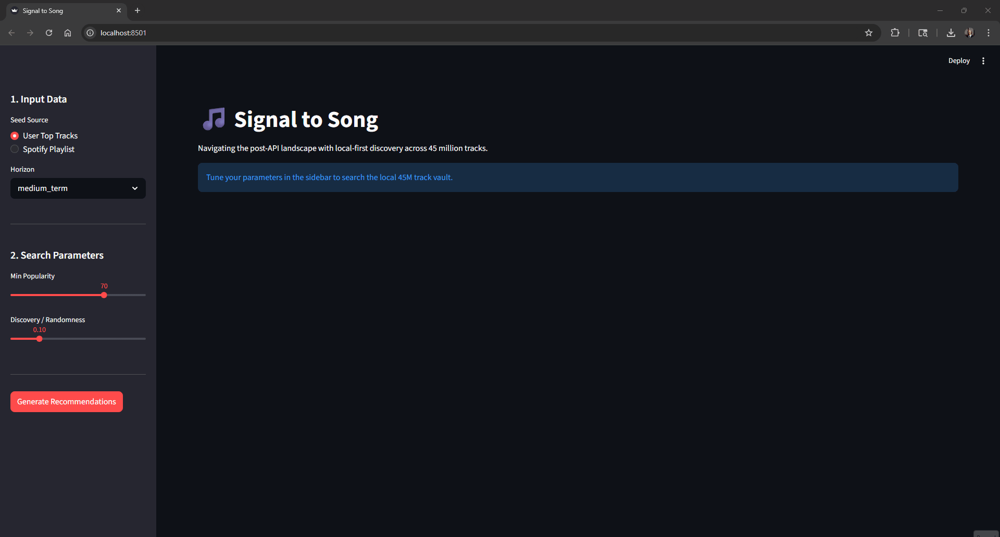

# Signal to Song
### High-Performance Local Discovery in a Post-API Landscape

Signal to Song is a high performance recommendation engine designed to navigate the vast landscape of 45 million tracks from the Anna’s Archive Spotify dataset. By leveraging vector embeddings and local storage, this project demonstrates how to build deeply personalized experiences that remain fully functional despite the deprecation of public audio feature APIs.

## The Vision
As major streaming platforms restrict access to granular audio metadata, the ability to perform local inference becomes essential for music researchers and enthusiasts. Signal to Song takes a different approach by bringing the engine to the data. It transforms raw, archived audio features into a searchable vector space, allowing for real time discovery based on the actual vibe of a track without relying on cloud based feature extraction.

## Technical Core
The project is built around a few primary pillars of data science and engineering.

### 1. Vector Search with LanceDB
Processing 45 million records requires more than just a standard relational database. I chose LanceDB for its ability to perform fast similarity searches directly from disk. This architectural choice ensures that the system remains responsive even when the dataset exceeds the available memory.

### 2. The Centroid Logic
To understand a user taste, the system calculates a multi dimensional Centroid Vector from their top tracks. By finding the nearest neighbors in the latent space, Signal to Song identifies music that shares the same mathematical DNA as the songs you already love.

The system uses Cosine Similarity to determine proximity in this high dimensional space.

$$\text{similarity} = \frac{\mathbf{A} \cdot \mathbf{B}}{\|\mathbf{A}\| \|\mathbf{B}\|}$$

### 3. The Deduplication Challenge
Music datasets are notoriously messy. The same track often appears multiple times across albums, singles, and compilations. Signal to Song implements a two stage grouping logic to ensure a clean user experience.

* **Relational Flattening:** Merging multiple artist rows into canonical strings for collaboration tracks.
* **Fuzzy Song Matching:** Grouping by song title and the new combined artist string to ensure the same track does not take up multiple slots in a recommendation list.

### 4. Diversity and Discovery
One of the biggest challenges in recommendation is the Filter Bubble. Signal to Song includes a discovery parameter that adds controlled variance to the search vector. This helps surface vibe adjacent tracks that might sit outside your typical listening habits but still resonate with your current mood.

## Key Features
* **Massive Scale:** Efficiently handles a dataset of 45,000,000 unique tracks.
* **Self-Sufficient Architecture:** All processing and searching happens locally, bypassing the need for external audio feature APIs.
* **Vector Normalization:** Sophisticated scaling of features like tempo and loudness to ensure balanced distance metrics.
* **Interactive Exploration:** A Streamlit based dashboard for real time vibe adjustment and discovery.

## Installation and Setup
To get started, clone the repository and install the dependencies.

`pip install -r requirements.txt`

You will also need to have your local LanceDB instance populated using the provided data pipeline script. Ensure your .env file is configured with your Spotify API credentials and your local data base path.

## Future Roadmap
This project is an ongoing exploration of high scale vector search. Future updates will focus on the following areas.

* **Dimensionality Reduction:** Implementing UMAP (Uniform Manifold Approximation and Projection) to project the 12 dimensional audio space into an interactive 3D visualization. This will allow users to navigate their musical taste as a literal landscape.
* **Alternative Distance Metrics:** Exploring Manhattan ($L_1$) and Euclidean ($L_2$) distance calculations to compare how different mathematical approaches change the "flavor" of the recommendations.
* **Graph-Based Refinement:** Looking into Hybrid-Search models that combine vector similarity with graph-based artist relationships to further improve relevance.

## About the Author
I am Andrew Shade, a Senior Data Scientist based in San Diego with a passion for building systems that bridge the gap between complex data and human intuition. My work at Curinos focuses on high scale analytics and creating tools that remain robust in the face of changing data landscapes. I was recently accepted into the Online Master of Science in Analytics program at Georgia Institute of Technology for the Fall 2025 semester.